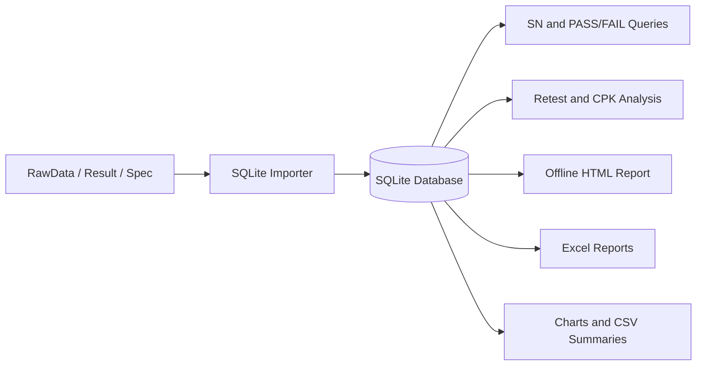

# AcousticSQLiteTool

AcousticSQLiteTool is an offline Python and SQLite workflow for importing,
organizing, querying, and reporting acoustic test data.

The repository includes a fully synthetic `ST01` demonstration dataset. It can
be used to evaluate PASS/FAIL results, retests, process capability (CPK), raw
measurement exports, and management reports without exposing actual customer or
production information.

## Features

- Incrementally imports `RawData`, `Result`, and manually maintained `Spec`
  files into SQLite.
- Supports multiple project folders in one database.
- Queries records by serial number and PASS/FAIL result.
- Identifies retested serial numbers and calculates retest rate.
- Compares CPK using:
  - the first valid test attempt for each serial number;
  - all valid test attempts, including retests.
- Generates completely offline HTML management reports.
- Generates multi-sheet Excel management reports.
- Exports selected RawData measurements to Excel by date.
- Generates acoustic charts and CSV statistical summaries.
- Works without a network connection after the Python environment and packages
  have been prepared.

## Workflow



## Project Structure

```text
AcousticSQLiteTool/
├─ acoustic_sqlite_importer.py    # Main import and query command
├─ database.py                    # SQLite schema, indexes, and views
├─ file_parser.py                 # Filename, CSV, Procedure, and StatusInfo parsers
├─ data_importer.py               # RawData and Result import workflow
├─ spec_importer.py               # ST01/Spec import workflow
├─ report_queries.py              # PASS, FAIL, retest, and CPK queries
├─ report_generator.py            # Report filtering and orchestration
├─ html_report.py                 # Completely offline HTML report
├─ excel_report.py                # Multi-sheet Excel report
├─ measurement_data_service.py    # Shared SQLite measurement queries
├─ rawdata_excel_exporter.py      # RawData Excel export by date and measurement
├─ visualize_acoustic_database.py # Acoustic charts and statistical summaries
├─ generate_public_demo_data.py   # Synthetic demonstration-data generator
├─ requirements.txt
├─ READEME.md
├─ .gitignore
├─ code_github.txt
│
├─ Demo_Public/
│  ├─ 9DR9000B9.DEMO/
│  │  └─ ST01/
│  │     ├─ RawData/
│  │     ├─ Result/
│  │     └─ Spec/
│  └─ 9DR9000K9.DEMO/
│     └─ ST01/
│        ├─ RawData/
│        ├─ Result/
│        └─ Spec/
│
├─ database/
└─ reports/
```

## Public Demo Dataset

All project codes, serial numbers, timestamps, specifications, measurements,
and results in `Demo_Public` are synthetic.

| Demo SN | First attempt | Retest | Demonstration purpose |
|---|---:|---:|---|
| `DEMO_B_000001` | PASS | None | Normal PASS |
| `DEMO_B_000002` | FAIL | PASS | Successful retest |
| `DEMO_B_000003` | FAIL | FAIL | Final FAIL |
| `DEMO_K_000001` | PASS | None | Second model PASS |
| `DEMO_K_000002` | PASS | PASS | Repeated measurement |
| `DEMO_K_000003` | FAIL | PASS | Second model retest |

The included limits use the revision name `DEMO_SPEC_V1` and are intended only
to demonstrate specification evaluation and CPK calculations.

## Requirements

The public demo has been tested with the following environment:

| Component | Version |
|---|---:|
| Python | 3.8.10 |
| pandas | 2.0.3 |
| matplotlib | 3.7.5 |
| openpyxl | 3.1.5 |

SQLite support is provided by Python's standard-library `sqlite3` module.

## Installation

Open Windows Command Prompt in the project directory.

```bat
python -m venv .venv
.venv\Scripts\activate
python -m pip install --upgrade pip
python -m pip install -r requirements.txt
```

For an offline computer, download compatible Python packages on a connected
computer first and install them from a local package folder.

## Quick Start

### 1. Build the public demo database

```bat
python acoustic_sqlite_importer.py ^
  --root "Demo_Public" ^
  --station ST01 ^
  --database "database\acoustic_demo_public.db"
```

The importer is incremental. Run the same command again after supported source
files are added or updated.

### 2. Query a demo serial number

```bat
python acoustic_sqlite_importer.py ^
  --database "database\acoustic_demo_public.db" ^
  --query-only ^
  --sn "DEMO_B_000002"
```

The expected history for `DEMO_B_000002` is `FAIL` followed by `PASS`.

### 3. Generate an offline HTML report

```bat
python report_generator.py ^
  --database "database\acoustic_demo_public.db" ^
  --station ST01 ^
  --format html ^
  --output-dir "reports" ^
  --output-name "ST01_demo_all_dates"
```

The generated HTML file contains embedded styles and does not require a network
connection, web server, or external assets.

### 4. Generate an Excel management report

```bat
python report_generator.py ^
  --database "database\acoustic_demo_public.db" ^
  --station ST01 ^
  --format excel ^
  --output-dir "reports"
```

### 5. Export frequency-response RawData

```bat
python rawdata_excel_exporter.py ^
  --database "database\acoustic_demo_public.db" ^
  --station ST01 ^
  --date 2025-01-15 ^
  --measurement FREQRESP_IN_1
```

### 6. Generate visualizations

```bat
python visualize_acoustic_database.py ^
  --database "database\acoustic_demo_public.db" ^
  --station ST01 ^
  --dataset all ^
  --output-dir "reports\visualizations_all"
```

## Dataset Modes

Visualization and CPK analysis support two dataset modes:

| Mode | Meaning |
|---|---|
| `all` | Use all valid test attempts, including retests. |
| `first` | Use only the first valid test attempt for each serial number. |

Chart display limits only control how many samples or legend entries are drawn.
Statistical summaries, CSV outputs, histograms, and CPK calculations continue
to use the complete selected dataset.

## Main Outputs

| Output | Description |
|---|---|
| SQLite database | Normalized test runs, measurement points, specifications, and query views |
| Offline HTML | PASS/FAIL, yield, retest, CPK, measurement, and specification report |
| Excel report | Multi-sheet management analysis report |
| RawData Excel | Date- and measurement-specific detailed export |
| PNG charts | Acoustic distributions, frequency response, specification margins, and capability plots |
| CSV summaries | Statistical and capability calculation results |

## Data and Privacy Notice

This public repository must contain synthetic demonstration data only.

- No actual customer, product, device, serial number, production path, or
  confidential specification is represented.
- Do not commit real databases, reports, RawData, Result, or Spec files.
- Do not commit SQLite temporary files such as `*.db-wal` or `*.db-shm`.
- Review generated reports and database source paths before publishing them.
- Validate all parsers, specifications, and calculations before using the tool
  for an actual engineering or manufacturing decision.

## Limitations

- The importer expects the demonstrated folder structure and supported source
  filename formats.
- CPK is calculated only when a numeric scalar measurement has a valid LSL
  and/or USL and sufficient samples.
- Very large datasets can be analyzed, but sample-based charts intentionally
  limit the number of displayed traces and labels for readability.
- The current command examples use Windows Command Prompt syntax.

## License

No open-source license is currently granted. The repository is provided for
portfolio and demonstration purposes. Add an explicit license only after
confirming ownership and publication rights for all included source code.
